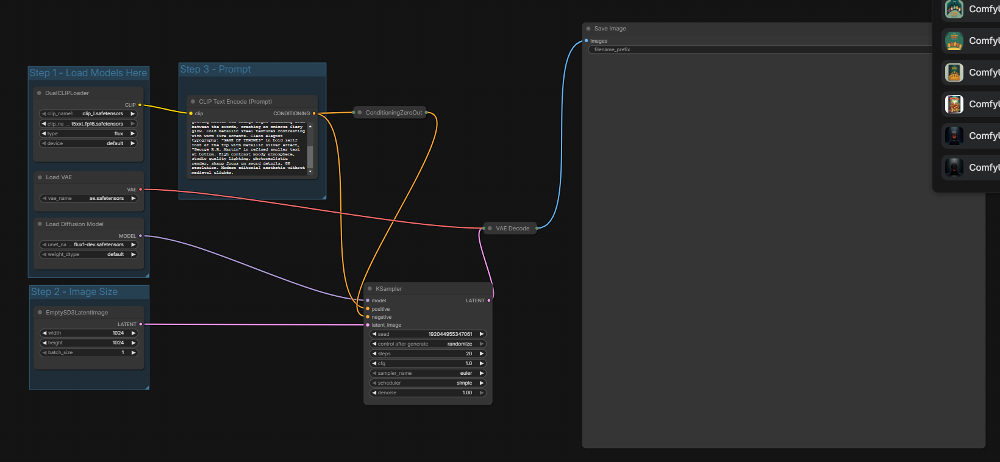
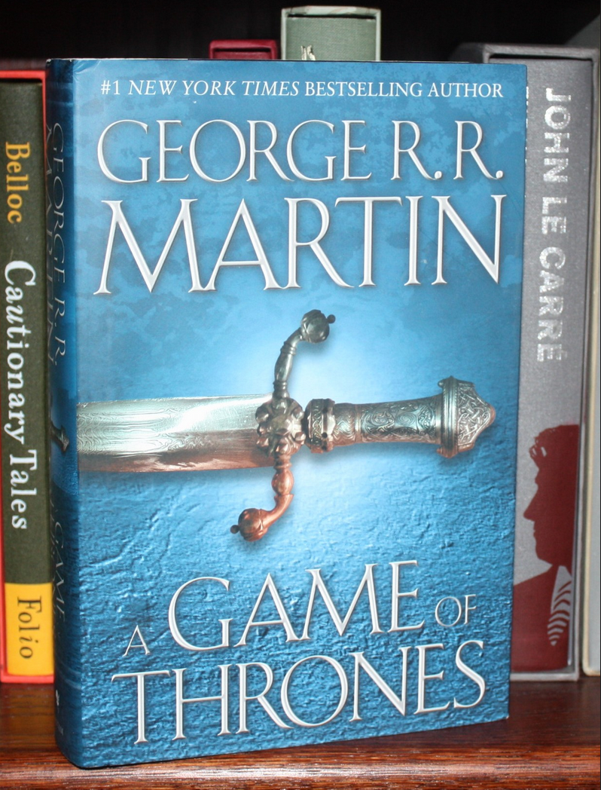
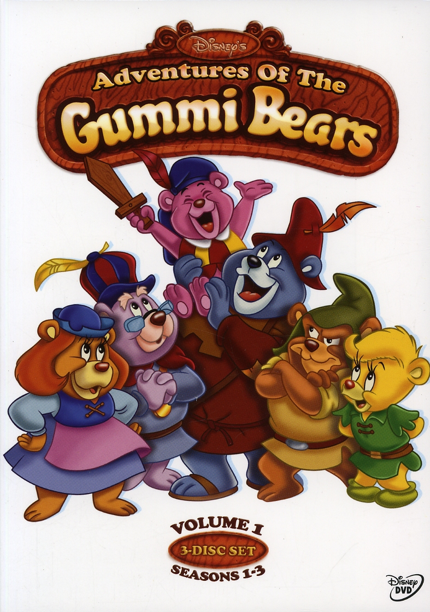
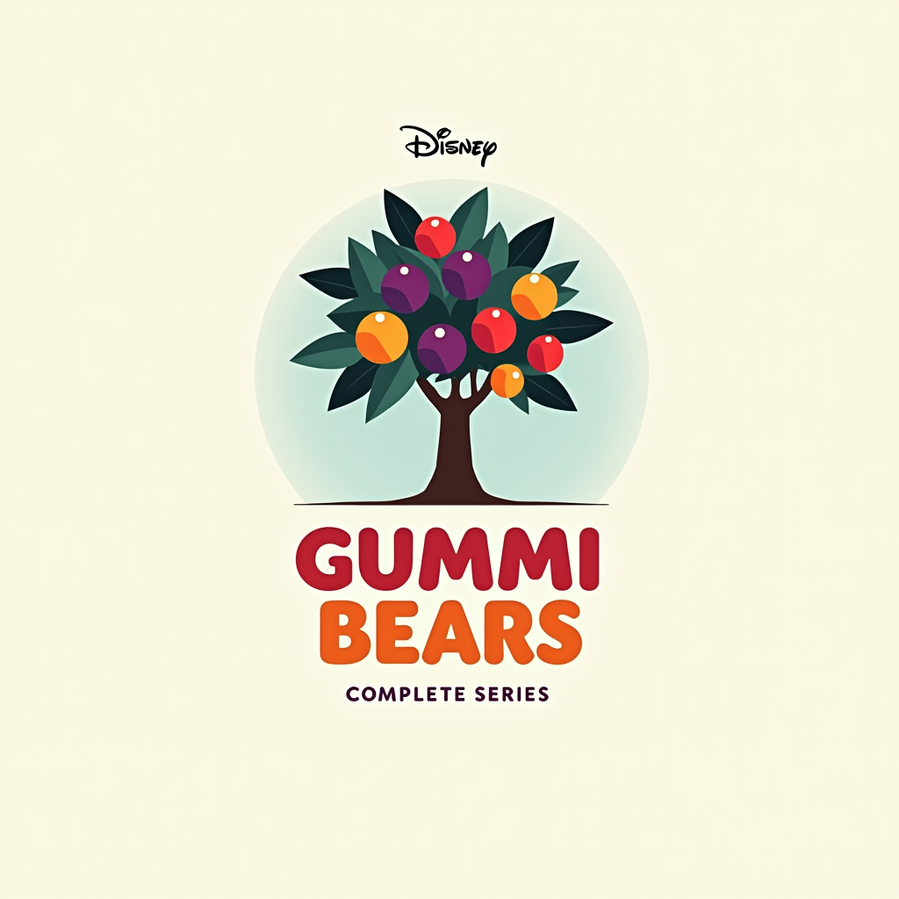
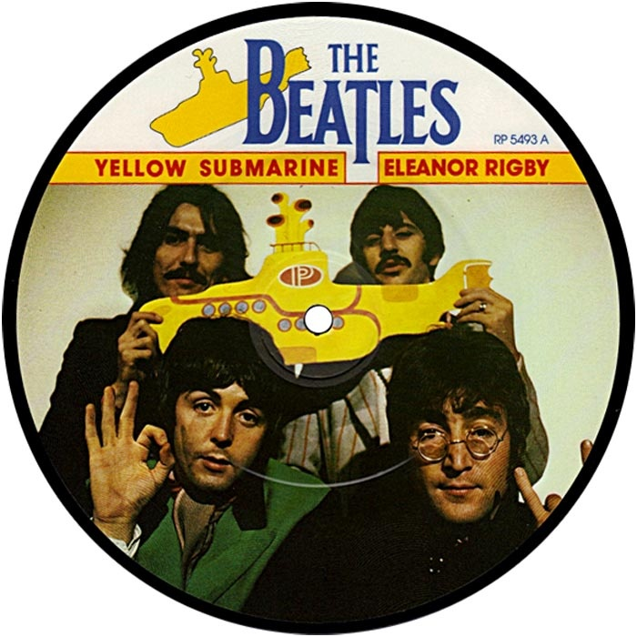
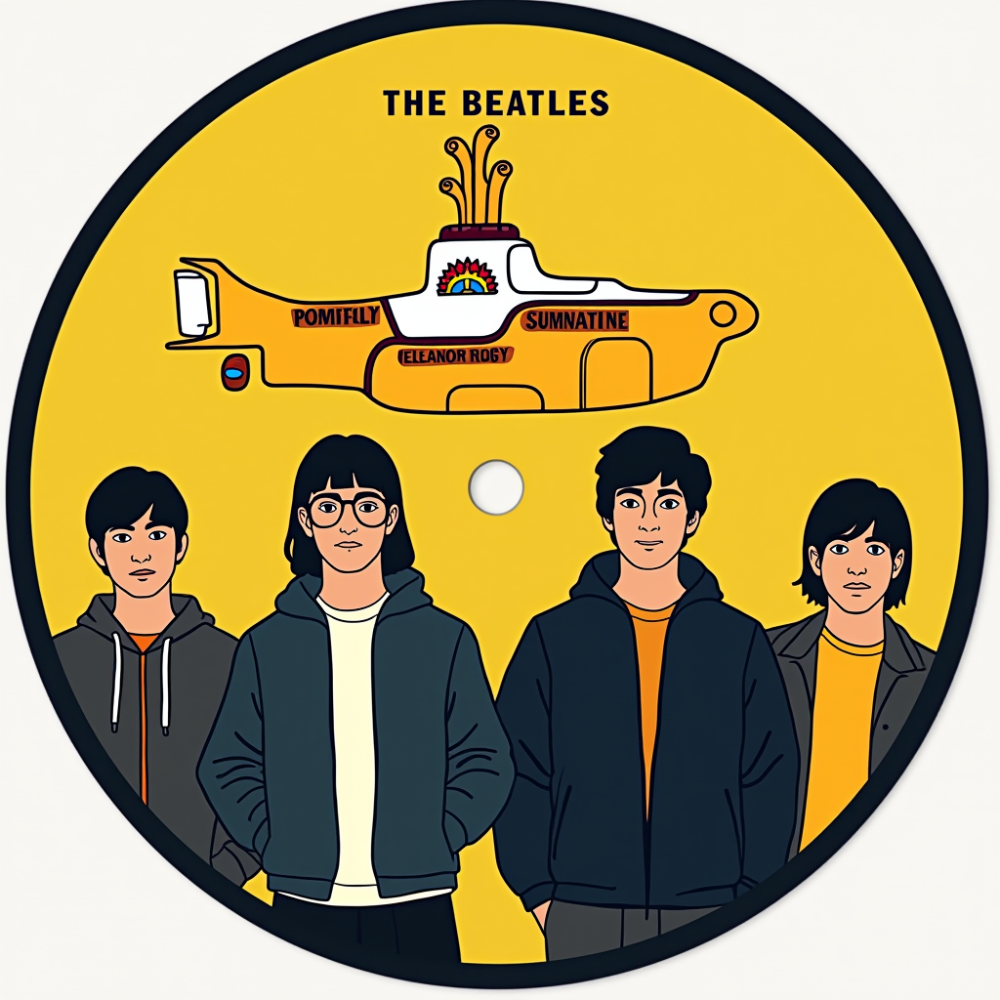

# AI-Generated Modern Cover Art Redesign Project

## Overview

For this assignment, the flux1-dev model was used, integrated into a workflow created in ComfyUI.

The clip_l encoder is used to encode the prompt text. An empty tensor is substituted as the negative prompt through the ConditioningZeroOut block. The KSampler node performs image generation, and the VAE node decodes it into RGB for display.

The goal of this assignment was to give a modern appearance to iconic images from media cover arts. The result became an exploration of whether beautiful modern cover designs can be created in a short period of time.

The conclusion is that modern design as understood by the neural network (with prompts assisted by Claude Sonnet 4.5) is absolutely disastrous from an aesthetic standpoint. Satisfactory results were only achieved with the relatively recent Iron Throne imagery, while the classic cartoon and Beatles album turned out disappointingly bland.

## Workflow Overview

## Game of Thrones Book Cover

### Prompt

A modern sophisticated book cover design for Game of Thrones. Centered composition featuring the iconic Iron Throne made from hundreds of real swords and blades melted together, sharp steel edges clearly visible. The throne sits on a black pedestal against a dark gradient background (charcoal to slate blue). Dramatic cinematic lighting with glowing molten red-orange light emanating from between the swords, creating an ominous fiery glow. Cold metallic steel textures contrasting with warm fire accents. Clean elegant typography: "GAME OF THRONES" in bold serif font at the top with metallic silver effect, "George R.R. Martin" in refined smaller text at bottom. High contrast moody atmosphere, studio quality lighting, photorealistic render, sharp focus on sword details, 8K resolution. Modern editorial aesthetic without medieval clichés.

### Original Cover

### Generated Image

### Analysis

It can be noted that the neural network is more familiar with design examples from the TV series, which has been popular since the mid-2010s and continues to this day. Therefore, in my opinion, due to the well-developed series artwork, modern aesthetics fit the book cover quite well. However, it's worth noting that the Iron Throne artwork is not typically the main theme of the book cover (which has a different title compared to the series, where the throne references the title).

## Disney's Gummi Bears DVD Cover

### Prompt

Modern minimalist DVD cover design for Disney's Gummi Bears. Centered composition featuring a stylized gummiberry bush with clusters of vibrant berries - mix of purple, magenta, red, and golden berries on simplified geometric branches with dark green leaves. Clean flat design aesthetic with solid colors, no gradients. The bush is elegantly simplified into basic shapes while remaining recognizable. Soft gradient background from cream to pale blue. Bold contemporary sans-serif typography: "GUMMI BEARS" in large rounded letters below the bush, warm orange to berry purple gradient. Small elegant "Disney" text above in classic Disney font. Minimal design, plenty of negative space, sophisticated color palette (5-6 colors total), vector art style, clean lines, editorial poster quality. Bottom text "Complete Series" in thin modern font. No characters, focus on the iconic gummiberry plant as the hero element. Print-ready 300 DPI.

### Original Cover

### Generated Image

### Analysis

The neural network is clearly unfamiliar with imagery from this cartoon. The bears turned out too generic, and the flat suprematist design made the disc image TOO distant from the original. Using a different pipeline where the neural network transformed the original image didn't help either. As a result, the approach of depicting a berry bush, which is one of the main elements of the cartoon, was chosen. In this form, the design at least doesn't evoke disgust.

## The Beatles - Yellow Submarine Album

### Prompt

Modern 2026 reimagining of The Beatles Yellow Submarine vinyl picture disc. Circular vinyl record format with center hole. Contemporary minimalist design aesthetic. Four band members in stylized flat illustration style wearing modern streetwear - hoodies, minimalist jackets, contemporary fashion. Clean geometric yellow submarine icon in center, simplified with flat colors and bold outlines. Modern sans-serif typography: "THE BEATLES" in bold capitals at top, sleek font. "YELLOW SUBMARINE" and "ELEANOR RIGBY" in contemporary typeface on horizontal bars. Limited color palette: vibrant yellow, deep navy blue, black, white, with subtle gradients. Flat vector art style for band portraits with geometric shapes and clean lines. No vintage texture or grain. Contemporary graphic design principles - negative space, color blocking, sophisticated minimalism. Keep circular vinyl disc format with black border. Modern editorial poster aesthetic meets album art. High contrast, sharp digital illustration, 2026 design trends, 300 DPI print quality.

### Original Cover

### Generated Image

### Analysis

Simplified into a flat design style typical of modern corporations, the band members look repulsive. As does the overall cover design. It would be interesting to know if a more powerful model could produce a better result. But obviously, this neural network failed the task.

## Conclusions

This experiment demonstrates that while AI image generation has advanced significantly, translating classic iconic designs into modern aesthetic language remains a considerable challenge. The neural network's interpretation of "modern design" often results in oversimplified, corporate-style imagery that lacks the character and appeal of the original works. Success seems to depend heavily on the model's familiarity with the source material and the relative modernity of the original design.
