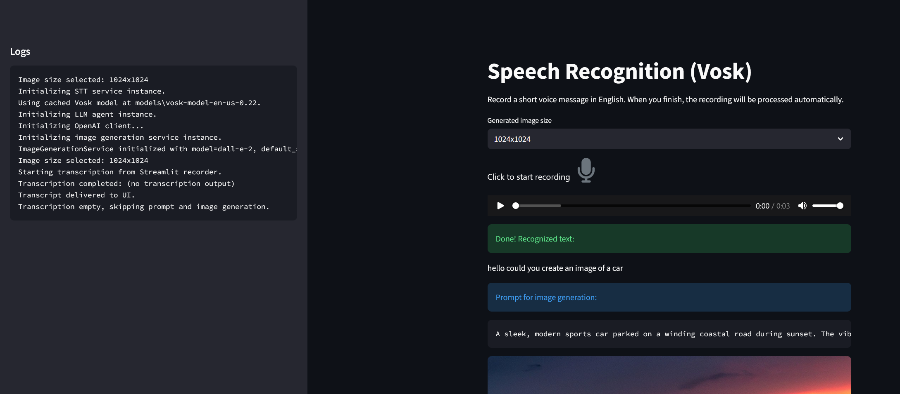
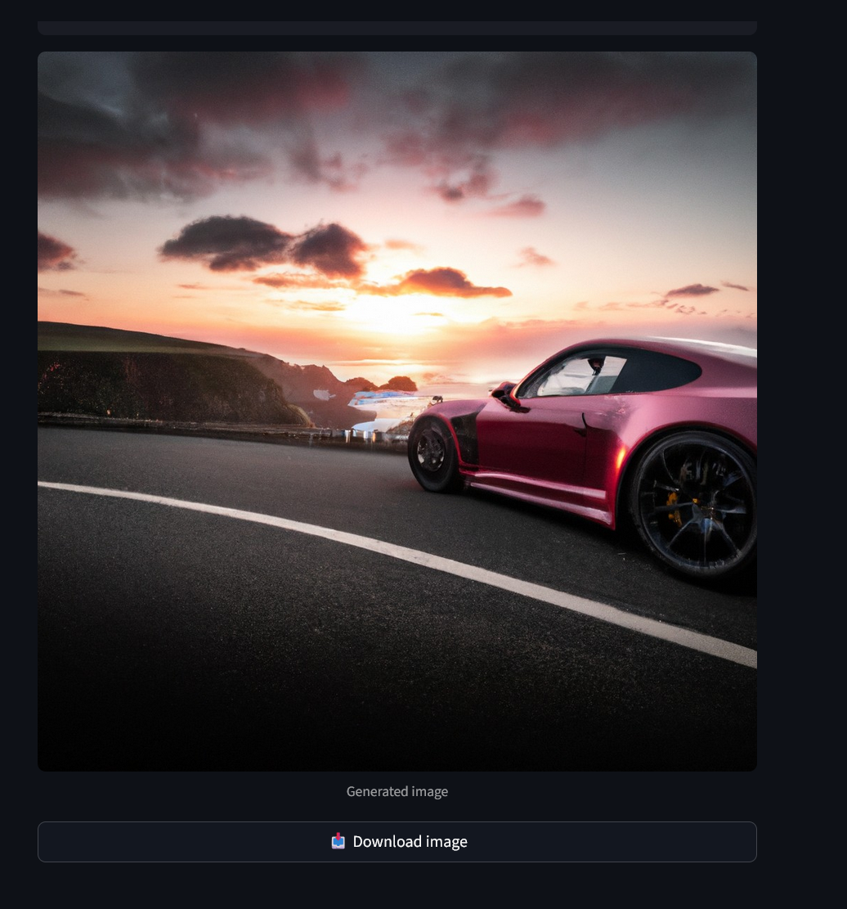

# Speech-to-Image Streamlit App

Offline speech recognition + GPT prompt crafting + image synthesis, wrapped in a Streamlit interface.  
Users record a short English voice message, application transcribe it locally with Vosk, improve the description via GPT, and generate an image using OpenAI’s image API.  
The sidebar shows a live log of every step, which makes debugging and demos easier.

---

## Features
- **Offline speech-to-text**: Uses Vosk (`dall-e-2` model) so recordings stay local.
- **LLM prompt refinement**: GPT takes the raw transcript and turns it into a polished image prompt.
- **Image generation**: OpenAI’s `dall-e-2` renders the final picture (base64 payload).
- **Streamlit UI**: Single-page app with an audio recorder, transcript output, prompt preview, and generated image preview.
- **Shared logger**: `services/logger.py` keeps a global buffer which feeds Streamlit’s sidebar.
- **Docker-ready**: `Dockerfile` matches Hugging Face Spaces (Docker) requirements out of the box.

---

## Quickstart (Local)
```bash
python -m venv .venv
.venv\Scripts\activate      # Windows
# or source .venv/bin/activate on macOS/Linux

pip install -r requirements.txt
set OPENAI_API_KEY=... or create .env file      # Use export on macOS/Linux

streamlit run streamlit_app.py
```
Open http://localhost:8501 in your browser.

---

## Docker
```bash
docker build -t stt-image-app .
docker run -p 7860:7860 -e OPENAI_API_KEY=your_key stt-image-app
```
The app will be reachable at http://localhost:7860.

---

## Project Structure
```
streamlit_app.py      # UI orchestration: recording → transcription → prompt → image
services/
  stt_service.py      # Vosk model download + transcription
  llm_agent.py        # GPT prompt generation
  image_service.py    # OpenAI image generation (base64 response)
  logger.py           # Shared in-memory log buffer
```

---

## Usage Notes
- The audio recorder component outputs WAV PCM at various bitrates; we re-sample to 16 kHz mono before hitting Vosk to improve accuracy.
- The `ImageGenerationService` always requests base64 data. Streamlit renders the decoded bytes directly, so no external URLs are exposed.
- If transcription fails (empty result), prompt + image steps are skipped to avoid burning API credits.

---

## Environment Variables
| Variable         | Purpose                                   |
|------------------|-------------------------------------------|
| `OPENAI_API_KEY` | Required. Used for GPT prompt and DALL-E. |

---

## Screenshots




